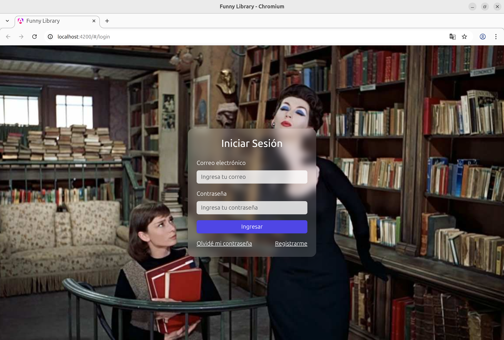
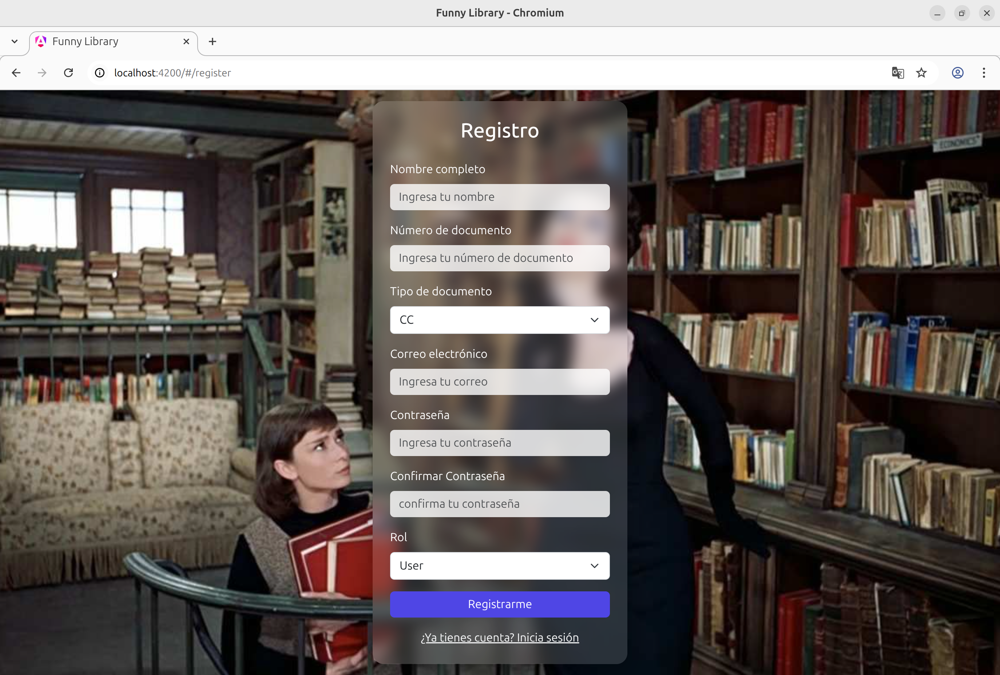
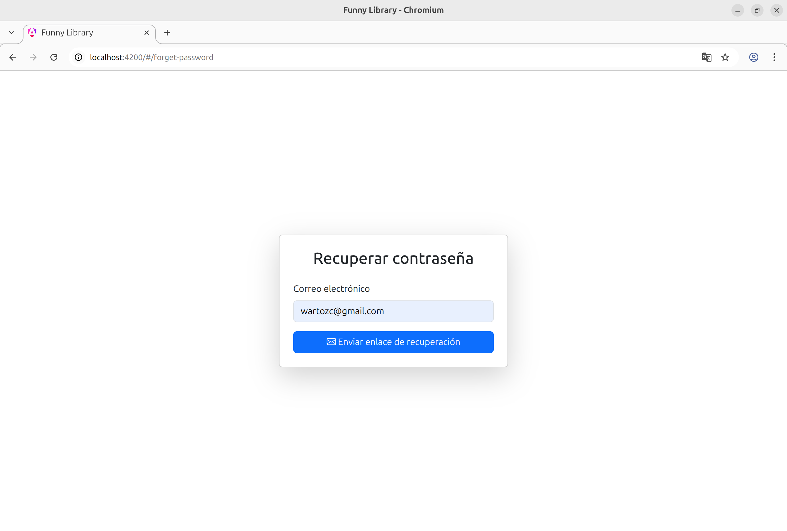
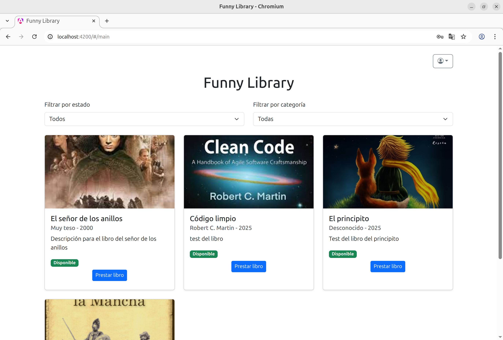
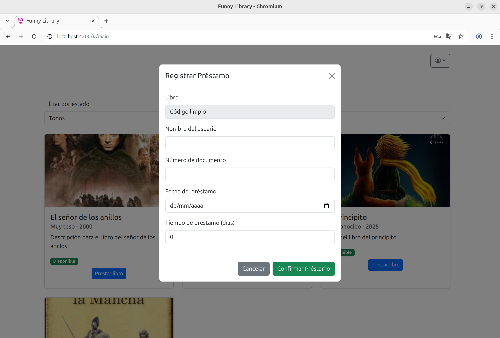
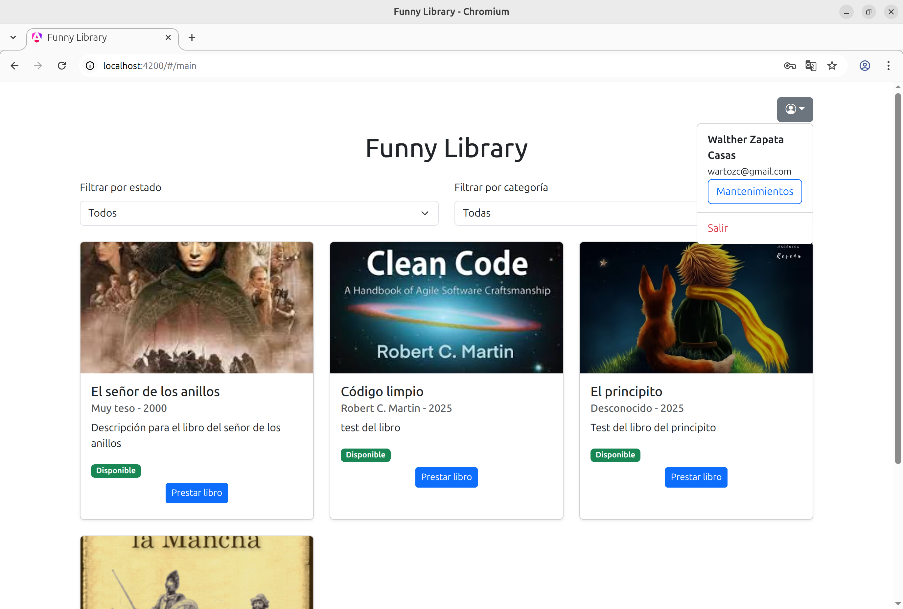
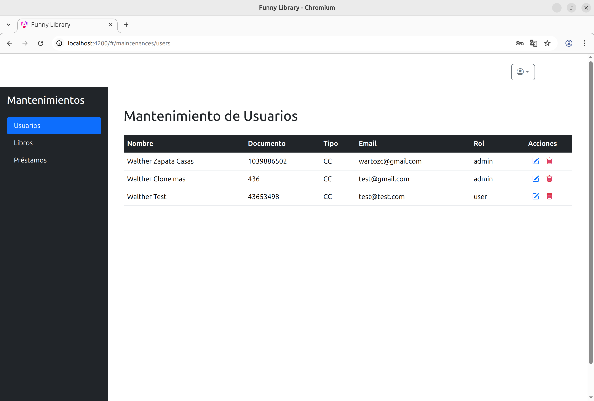
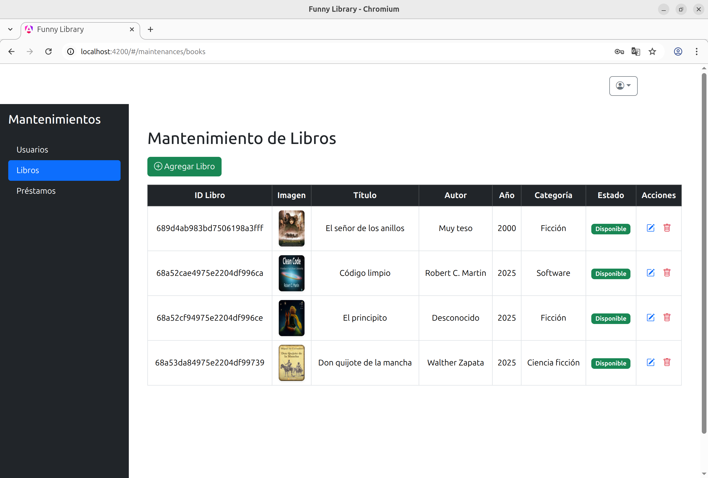
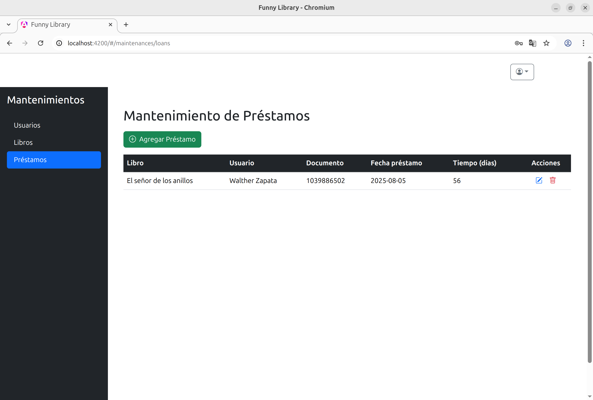

# Manual de Usuario - Funny Library (Frontend)

Bienvenido a **Funny Library**. Este manual te guiará paso a paso para utilizar la aplicación web desarrollada en Angular, donde podrás gestionar usuarios, libros y préstamos de una biblioteca.

---

## 1. Acceso a la aplicación

Al ingresar a la aplicación, verás la pantalla de inicio de sesión:

- Ingresa tu correo electrónico y contraseña.
- Si no tienes cuenta, haz clic en "Registrarme".
- Si olvidaste tu contraseña, haz clic en "Olvidé mi contraseña".

---

## 2. Registro de usuario

Haz clic en "Registrarme" para crear una nueva cuenta:

- Completa todos los campos requeridos.
- Elige tu rol (por defecto es "user").
- Haz clic en "Registrarme".

---

## 3. Recuperar contraseña

Si olvidaste tu contraseña, accede a la opción de recuperación:

- Ingresa tu correo electrónico y sigue las instrucciones.

---

## 4. Página principal

Una vez autenticado, accederás a la página principal:

- Puedes filtrar libros por estado (disponible/prestado) y por categoría.
- Haz clic en "Prestar libro" para solicitar un préstamo.

---

## 5. Préstamo de libros

Al seleccionar "Prestar libro", se abrirá un formulario:

- Completa tus datos y la información del préstamo.
- Haz clic en "Confirmar Préstamo".

---

## 6. Módulo de Mantenimientos (solo administradores)

Si eres administrador, tendrás acceso al módulo de mantenimientos:

### 6.1. Gestión de usuarios

- Edita o elimina usuarios existentes.

### 6.2. Gestión de libros

- Agrega, edita o elimina libros.

### 6.3. Gestión de préstamos

- Agrega, edita o elimina los préstamos realizados.

**Nota:** Para registrar un préstamo desde esta pantalla, es necesario tener el ID del libro, este lo encuentra en la pantalla de mantenimiento de libros.

---

## 7. Cerrar sesión

Haz clic en el ícono de usuario (arriba a la derecha) y selecciona "Salir" para cerrar tu sesión.

---

## Recomendaciones

- Asegúrate de que el backend esté en funcionamiento antes de usar la aplicación.
- Si tienes problemas de acceso, verifica tu conexión y credenciales.

**Desarrollado por Walther Zapata Casas**  
© Walther Zapata Casas - 2025. Todos los derechos reservados.

